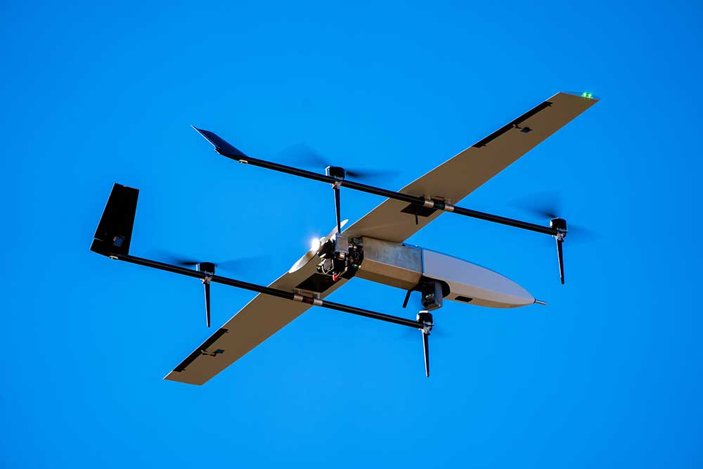

# MK1 Documentation

Welcome to the EchoMAV Technical Library for the MK1 UAS

- [:material-border-all: Overview](overview.md)
- [:material-run-fast: Quick Start](quickstart.md)
- [:fontawesome-solid-microchip: Maintenance Guide](maintenance.md)
- [:octicons-file-binary-24: Software Guide](software.md)
- [:fontawesome-regular-file-code: User Guide](userguide.md)
- [:material-connection: Pinouts](electrical.md)
- [:fontawesome-solid-gear: Mechanical](mechanical.md)

