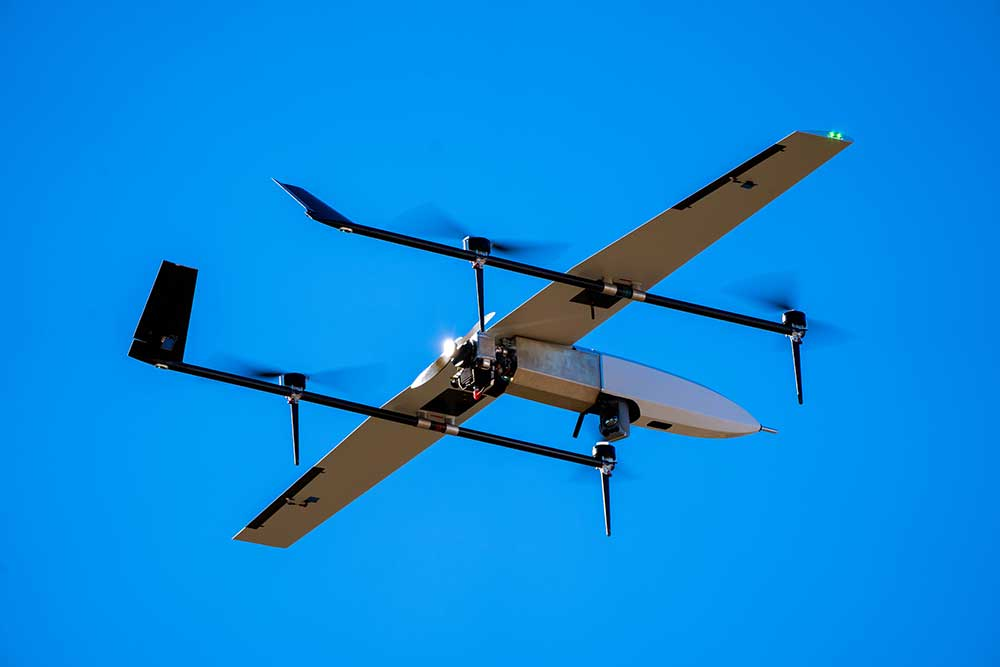

# MK1 Documentation

## Overview

The MK1 is a Class II Hybrid-Power VTOL. 

       

## Maintenance

### Servo Replacement

#### Ruddervator Servo Replacement

#### Aileron Servo Replacement

### Battery Replacement

### Fuel Filter Check/Clean

### VTOL Prop Replacement

### Engine Prop Replacement

### Landing Gear Replacement
